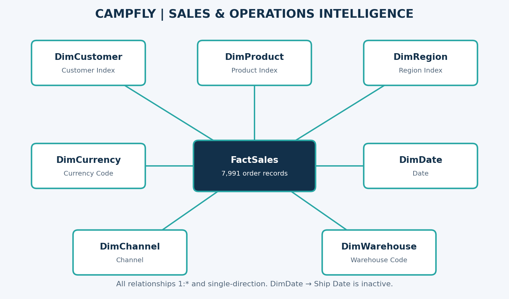
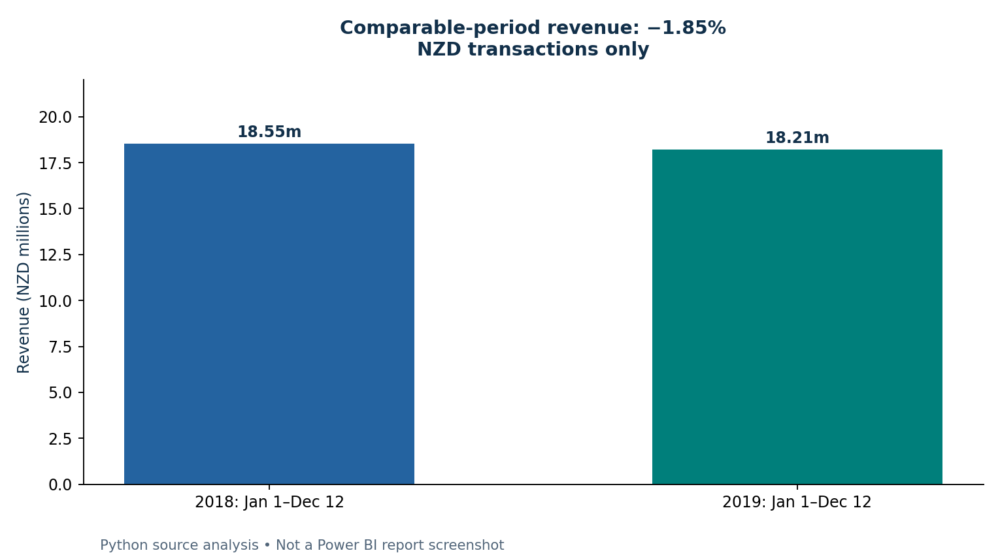
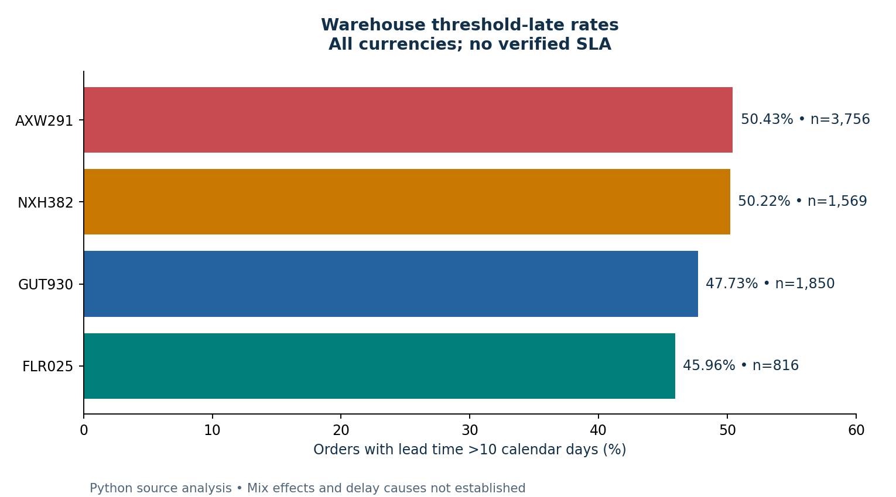
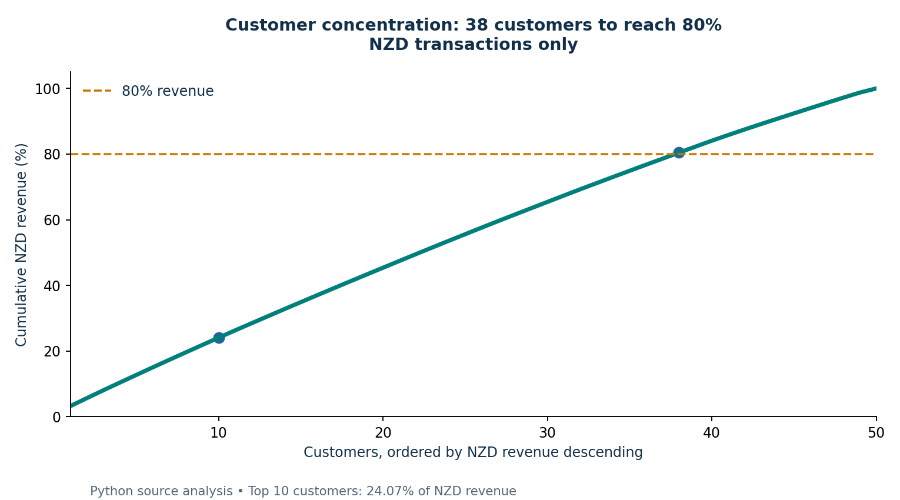
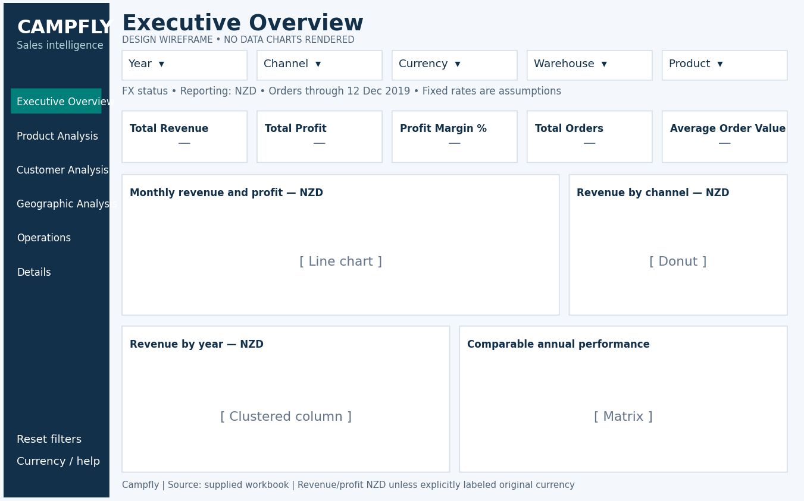

# Campfly | Sales & Operations Intelligence

A reproducible Power BI build package for sales profitability, customer/product performance and fulfillment analysis.

## Status
**Prepared:** source audit; Power Query cleaning; star-schema model plan and image; DAX definitions; six-page visual/interaction blueprint; theme; design wireframes; Python-verified insights; validation files; publishing/refresh checklist.

**Not yet completed in Power BI Desktop/Service:** executing M/DAX in Desktop, constructing/validating the report, actual PBIX/project export, genuine report screenshots, publishing and scheduled refresh. Do not mistake design wireframes or Python analytical charts for Power BI report screenshots.

## Problem statement
Give sales and operations readers consistent views of revenue, contribution-style source profit, product/customer performance, geographic demand and lead-time patterns, while preventing mixed-currency sums and misleading partial-year comparisons.

## Dataset
Source: user-supplied Campfly Sales Analysis Dashboard.xlsx. No external provenance, license, FX rates or business SLA was supplied. Obtain permission before redistributing real customer/address data.
- 7,991 sales records, 7,991 unique order numbers.
- Order dates 2017-01-01 to 2019-12-12; ship dates 2017-01-05 to 2019-12-28.
- 50 customers; 100 regions; 15 dimension products, 14 with sales; 4 warehouses; 3 channels; 5 currencies.
- 13 customer names need trimming; no missing sales fields or orphan dimension keys in the supplied source.

## Tools
Power BI Desktop / Service (build and deployment target); Power Query M; DAX; Python/pandas for independent source analysis; matplotlib for analytical charts; JSON Schema validation for theme.

## Model
FactSales centered on DimCustomer, DimRegion, DimProduct, DimCurrency, DimChannel, DimWarehouse and DimDate. All dimension-to-fact relationships 1:* single-direction. Order Date active; Ship Date inactive for role-specific measures.



## Currency/financial policy
NZD reporting target. NZD=1; non-NZD rates are deliberately missing until documented assumptions are supplied. Convert revenue AND costs row-by-row before summing; stop/blank invalid-rate contexts. Original amounts require one source currency. Current financial insights use NZD transactions only, not assumed conversion of other currencies. Costs' currency is not independently verified; profits/margins assume row currency applies to costs. This source profit is revenue minus recorded unit costs, not net profit with freight/tax/overheads unless those costs are documented.

## Report pages
1. Executive Overview — finance KPIs, monthly revenue/profit, channels, year and comparable-period views.
2. Product Analysis — financial matrix, quantity/margin scatter, top/bottom products.
3. Customer Analysis — top customers, distribution, Pareto, year matrix.
4. Geographic Analysis — coordinates-based map, top regions and channel matrix.
5. Operations — warehouse performance, lead-time distribution and ship-date late trend.
6. Details — order-level original and converted amounts with compatible drill-through targets.

## Key verified findings
- Partial-year adjustment: NZD 2019 revenue versus full 2018 is -8.91%, but matched Jan 1-Dec 12 YoY is -1.85%.
- Wholesale is 54.14% of NZD revenue; Distributor has the highest observed NZD channel margin at 37.73%.
- Product 7 leads NZD revenue (NZD 10.10m); Product 4 leads observed NZD margin (41.51%), on only 53 NZD orders.
- NZD customer base is not a classic 80/20 pattern: top 10 are 24.07% of revenue and 38 of 50 customers reach at least 80%.
- 49.31% of all orders exceed the analytical 10-calendar-day threshold; no promised-date SLA exists.
- AXW291 accounts for 47.00% of all order volume and 48.07% of threshold-late orders, making it a high-volume diagnostic priority, not a proven causal bottleneck.
- Only 37.87% of orders are NZD: missing FX prevents reliable all-currency converted financial findings.
- Product 20 is a valid dimension member with no recorded sales and should not be dropped silently.

See [`docs/insights/Insights_and_Recommendations.md`](docs/insights/Insights_and_Recommendations.md) and the CSV tables in [`docs/evidence/`](docs/evidence/) for scope and recommendations.

## Visual assets — not report screenshots




These are computed Python charts. Design previews are supplied separately, for example:


## Actual screenshot checklist — still outstanding
After building/validating the report, capture six screenshots with readable labels, default NZD selection and visible partial-year/FX notes. Add genuine files for Executive, Product, Customer, Geography, Operations and Details here. Do not replace this section with wireframes and claim the report is implemented.

## Reproduce
1. Start with Stage 1: configure local file parameter, paste M queries, load tables, create marked DimDate, set relationships/categories.
2. Stage 2: create _Measures, paste definitions individually and compare NZD/all-order QA benchmarks.
3. Stage 3: import theme, create supporting measures/region label, build 50 specified visuals, then navigation/bookmarks/tooltips/drill targets and validate interactions.
4. Stage 4: review verified insights, replace missing FX only with documented approved assumptions, capture actual screenshots, and follow the publish/refresh checklist.
5. Static historical source does not need scheduled refresh unless it will change. Local File.Contents requires a reachable source/gateway or a deliberate authenticated cloud-source redesign for Service refresh.

## Limitations
Partial 2019 coverage; no verified exchange rates; assumed cost currency; no promise date, delay reason, returns, discount, tax/freight/overhead breakdown, targets or historical prices independent of source. Descriptive margins/warehouse comparisons are not causal or tested forecasts. Raw multi-currency sums are prohibited. Hidden pages/columns are not security controls. DAX/Power BI visuals have not yet been executed here.

## Portfolio outputs
See [`docs/insights/Resume_Bullets.md`](docs/insights/Resume_Bullets.md), [`docs/insights/Publish_and_Refresh_Checklist.md`](docs/insights/Publish_and_Refresh_Checklist.md) and [`docs/evidence/Verified_Insights.csv`](docs/evidence/Verified_Insights.csv).

## Project page
Static project page (model diagram, wireframes, findings): https://suyashchoudhary123-hub.github.io/campfly-sales-operations-analytics/

## Repository layout
```
data/             Source workbook (confirm you may redistribute it)
powerquery/       M queries: pFilePath, SourceWorkbook, FactSales, Dim* tables
model/            DimDate (DAX calendar) and relationships.csv
dax/              _Measures table, 47 measures (measures/), report helpers (report-support/)
theme/            Campfly_Theme.json
docs/guides/      Stage 1 (model), Stage 2 (DAX), Stage 3 (visuals) build guides
docs/insights/    Insights, resume bullets, publish/refresh checklist
docs/evidence/    CSV tables behind each insight
docs/reference/   Measure catalog, QA benchmarks, per-visual layout spec
docs/assets/      Model diagram, Python charts, page wireframes
docs/index.html   GitHub Pages landing page
```

## License
MIT. See `LICENSE`.
